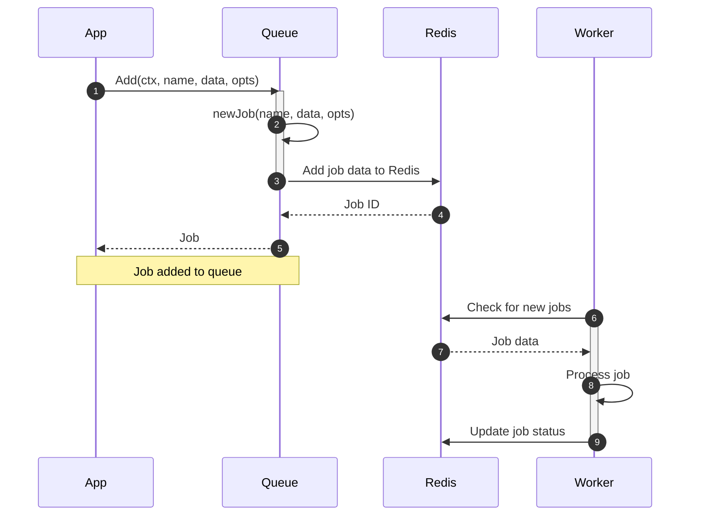

# Options

Job Options in `gobullmq` define the configuration settings for individual jobs within a queue. These options control various aspects of job processing, such as priority, retry attempts, delay, and persistence. They provide a flexible way to customize job behavior to meet specific application requirements.

## Overview of Job Options

Job options are encapsulated in the `JobOptions` struct within the `types` package. These options are applied when a job is added to a queue, influencing how the job is processed and managed by the worker. Key aspects include setting priority, managing retry attempts, delaying job execution, and defining job persistence policies.  The `JobOptions` struct is used extensively throughout the `gobullmq` library, affecting job creation, scheduling, and execution.

### Key Features

*   **Priority:** Determines the order in which jobs are processed.
*   **Attempts:** Configures the number of retry attempts for failed jobs.
*   **Delay:** Schedules jobs for execution after a specified delay.
*   **Persistence:** Defines policies for retaining jobs upon completion or failure.
*   **Repeatability:** Configures jobs to repeat based on a cron-like schedule or interval.
*   **Parent/Child Relationships:** Establishes dependencies between jobs.

## Detailed Breakdown of Job Options

This section provides a detailed look at the individual fields within the `JobOptions` struct and how they are used.

### `JobOptions` Struct Definition

The `JobOptions` struct is defined in `types/job.go`. It contains various fields that control the behavior of a job.

```go
// JobOptions defines options for configuring a job.
type JobOptions struct {
	Priority         int       `json:"priority,omitempty" msgpack:"priority,omitempty"`
	RemoveOnComplete *KeepJobs `json:"removeOnComplete,omitempty" msgpack:"removeOnComplete,omitempty"`
	RemoveOnFail     *KeepJobs `json:"removeOnFail,omitempty" msgpack:"removeOnFail,omitempty"`
	Attempts         int       `json:"attempts,omitempty" msgpack:"attempts,omitempty"`
	Delay            int       `json:"delay,omitempty" msgpack:"delay,omitempty"`
	TimeStamp        int64     `json:"timestamp,omitempty" msgpack:"timestamp,omitempty"`
	Lifo             bool      `json:"lifo,omitempty" msgpack:"lifo,omitempty"`
	JobId            string    `json:"jobId,omitempty" msgpack:"jobId,omitempty"`
	RepeatJobKey     string    `json:"repeatJobKey,omitempty" msgpack:"repeatJobKey,omitempty"`
	Token            string    `json:"token,omitempty" msgpack:"token,omitempty"` // The token used for locking this job.

	Repeat *JobRepeatOptions `json:"repeat,omitempty" msgpack:"repeat,omitempty"`

	// Added fields
	FailParentOnFailure       bool        `json:"failParentOnFailure,omitempty" msgpack:"failParentOnFailure,omitempty"`
	Parent                *ParentOpts     `json:"parent,omitempty" msgpack:"parent,omitempty"`
	RemoveDependencyOnFailure bool        `json:"removeDependencyOnFailure,omitempty" msgpack:"removeDependencyOnFailure,omitempty"`
}
```


### Field Descriptions

| Field                 | Type       | Description                                                                                                                                 | Sources                                  |
| --------------------- | ---------- | ------------------------------------------------------------------------------------------------------------------------------------------- | ----------------------------------------- |
| `Priority`            | `int`      | Determines the job's priority; lower values are processed first.                                                                           |                         |
| `RemoveOnComplete`    | `*KeepJobs` | Specifies how to handle jobs that complete successfully (e.g., keep the last N jobs or jobs younger than X seconds).                        |                         |
| `RemoveOnFail`        | `*KeepJobs` | Specifies how to handle jobs that fail (similar to `RemoveOnComplete`).                                                                     |                         |
| `Attempts`            | `int`      | Maximum number of attempts to process the job before marking it as failed.                                                                 |                         |
| `Delay`               | `int`      | Delay in milliseconds before the job becomes eligible for processing.                                                                      |                         |
| `TimeStamp`           | `int64`    | Timestamp (Unix milliseconds) indicating when the job was added.                                                                          |                         |
| `Lifo`                | `bool`     | If true, adds the job to the queue using LIFO (Last In, First Out) order.                                                                  |                         |
| `JobId`               | `string`   | A custom job ID; if not provided, an ID is automatically generated.                                                                       |                         |
| `RepeatJobKey`        | `string`   | Key used for repeatable jobs.                                                                                                              |                         |
| `Token`               | `string`   | Token used for locking the job.                                                                                                             |                         |
| `Repeat`              | `*JobRepeatOptions`   | Options for configuring repeatable jobs.                                                                                                              |                         |
| `FailParentOnFailure` | `bool`     | If true, the parent job will be marked as failed if this job fails.                                                                        |                         |
| `Parent`              | `*ParentOpts` | Defines the parent job for this job.                                                                                                      |                         |
| `RemoveDependencyOnFailure` | `bool`     | If true, the job's dependency will be removed from its parent even if the job fails.                                                                        |                         |

### Using Functional Options to Set Job Options

The `gobullmq` library uses functional options to configure `JobOptions` when adding jobs to a queue. This approach provides a flexible and readable way to set individual options.

```go
// AddOption defines the functional option type for Queue.Add
type AddOption func(*types.JobOptions)
```


#### Example: Setting Priority and Delay

```go
import "go.codycody31.dev/gobullmq"

// ...

job, err := queue.Add(ctx, "myJob", jobData,
    gobullmq.AddWithPriority(5),
    gobullmq.AddWithDelay(2000), // Delay by 2 seconds
)
```


#### Available Functional Options

The `common.go` file defines several functional options for configuring `JobOptions`.

*   `AddWithPriority(priority int)`: Sets the job's priority.
*   `AddWithRemoveOnComplete(keep ...types.KeepJobs)`: Configures job removal on completion.
*   `AddWithRemoveOnFail(keep ...types.KeepJobs)`: Configures job removal on failure.
*   `AddWithAttempts(times int)`: Sets the maximum number of attempts.
*   `AddWithDelay(delayMillis int)`: Sets the delay in milliseconds.
*   `AddWithTimestamp(tsMillis int64)`: Sets a custom timestamp.
*   `AddWithJobID(id string)`: Sets a specific job ID.
*   `AddWithRepeat(repeatOpts types.JobRepeatOptions)`: Configures the job to repeat.
*   `AddWithLifo()`: Adds the job using LIFO order.
*   `AddWithFailParentOnFailure(fail bool)`: Marks the job to fail its parent if it fails.
*   `AddWithParent(parentOpts types.ParentOpts)`: Sets the parent job information.
*   `AddWithRemoveDependencyOnFailure(remove bool)`: Marks the job's dependency to be removed from its parent even if this job fails.

### The `KeepJobs` Struct

The `KeepJobs` struct, used with `RemoveOnComplete` and `RemoveOnFail`, defines the policy for retaining jobs.

```go
// KeepJobs specifies how many completed/failed jobs to keep.
type KeepJobs struct {
	Age   int `json:"age,omitempty" msgpack:"age,omitempty"`     // Maximum age in seconds for job to be kept.
	Count int `json:"count,omitempty" msgpack:"count,omitempty"` // Maximum count of jobs to be kept.
}
```


*   `Age`:  Maximum age in seconds for a job to be retained.
*   `Count`: Maximum number of jobs to retain.

### The `JobRepeatOptions` Struct

The `JobRepeatOptions` struct is used to configure repeatable jobs.

```go
// JobRepeatOptions defines options for repeatable jobs.
type JobRepeatOptions struct {
	// CurrentDate time.Time `json:"currentDate,omitempty" msgpack:"currentDate,omitempty"` // The date from which the repeatition should start.
	StartDate    *time.Time `json:"startDate,omitempty" msgpack:"startDate,omitempty"`       // The date from which the repeatition should start.
	EndDate      *time.Time `json:"endDate,omitempty" msgpack:"endDate,omitempty"`         // The date until which the repeatition should happen.
	UTC          bool       `json:"utc,omitempty" msgpack:"utc,omitempty"`                 // Use UTC timezone.
	TZ           string     `json:"tz,omitempty" msgpack:"tz,omitempty"`                   // Timezone.
	NthDayOfWeek int        `json:"nthDayOfWeek,omitempty" msgpack:"nthDayOfWeek,omitempty"` // Nth day of week.
	Pattern      string     `json:"pattern,omitempty" msgpack:"pattern,omitempty"`           // Cron pattern.
	Limit        int        `json:"limit,omitempty" msgpack:"limit,omitempty"`             // Number of times the job should repeat at max.
	Every        int        `json:"every,omitempty" msgpack:"every,omitempty"`             // Repeat after this amount of milliseconds (`pattern` setting cannot be used together with this setting.)
	Immediately  bool       `json:"immediately,omitempty" msgpack:"immediately,omitempty"` // Repeated job should start right now (work only with every settings)
	Count       int    `json:"count,omitempty" msgpack:"count,omitempty"`             // The start value for the repeat iteration count.
	PrevMillis  int    `json:"prevMillis,omitempty" msgpack:"prevMillis,omitempty"`
	Offset      int    `json:"offset,omitempty" msgpack:"offset,omitempty"`
	JobId       string `json:"jobId,omitempty" msgpack:"jobId,omitempty"`
}
```


*   `StartDate`: The date from which the repetition should start.
*   `EndDate`: The date until which the repetition should happen.
*   `UTC`: Use UTC timezone.
*   `TZ`: Timezone.
*   `NthDayOfWeek`: Nth day of the week.
*   `Pattern`: Cron pattern.
*   `Limit`: Number of times the job should repeat at max.
*   `Every`: Repeat after this amount of milliseconds.
*   `Immediately`: Repeated job should start right now (works only with `Every` setting).
*   `Count`: The start value for the repeat iteration count.
*   `PrevMillis`: Previous Millis
*   `Offset`: Offset
*   `JobId`: Job Id

### The `ParentOpts` Struct

The `ParentOpts` struct defines options for job parent relationships.

```go
// ParentOpts defines options for job parent relationships.
type ParentOpts struct {
	Id    string `json:"id" msgpack:"id"`       // The job ID of the parent.
	Queue string `json:"queue" msgpack:"queue"` // The queue prefix (e.g., "bull:myParentQueue") of the parent.
}
```


*   `Id`: The job ID of the parent.
*   `Queue`: The queue prefix of the parent.

### Job Options Data Flow



This diagram illustrates the data flow when a job is added to the queue with specific options and how the worker processes the job.

### Code Snippets for Job Options

#### Setting Job Options

```go
job, err := queue.Add(ctx, "processImage", imageData,
    gobullmq.AddWithPriority(1),
    gobullmq.AddWithAttempts(3),
    gobullmq.AddWithDelay(5000),
)
if err != nil {
    fmt.Println("Error adding job:", err)
}
```


#### Parsing Job Options from JSON

The `JobOptsFromJson` function in `job.go` parses job options from a JSON string.

```go
func JobOptsFromJson(rawOpts string) (types.JobOptions, error) {
	var tempMap map[string]interface{}
	var jobOpts types.JobOptions

	if err := json.Unmarshal([]byte(rawOpts), &tempMap); err != nil {
		return jobOpts, fmt.Errorf("failed to unmarshal raw opts JSON: %w", err)
	}

	// ... (parsing logic)

	return jobOpts, nil
}
```


This function is used to reconstruct `JobOptions` from data stored in Redis.  It uses type assertions to safely extract values from the `map[string]interface{}` and populates the `JobOptions` struct.

## Conclusion

Job Options in `gobullmq` provide a comprehensive set of configurations for managing jobs within a queue.  By using functional options, developers can easily customize job behavior to meet specific application requirements. Understanding these options is crucial for effectively utilizing the `gobullmq` library.
