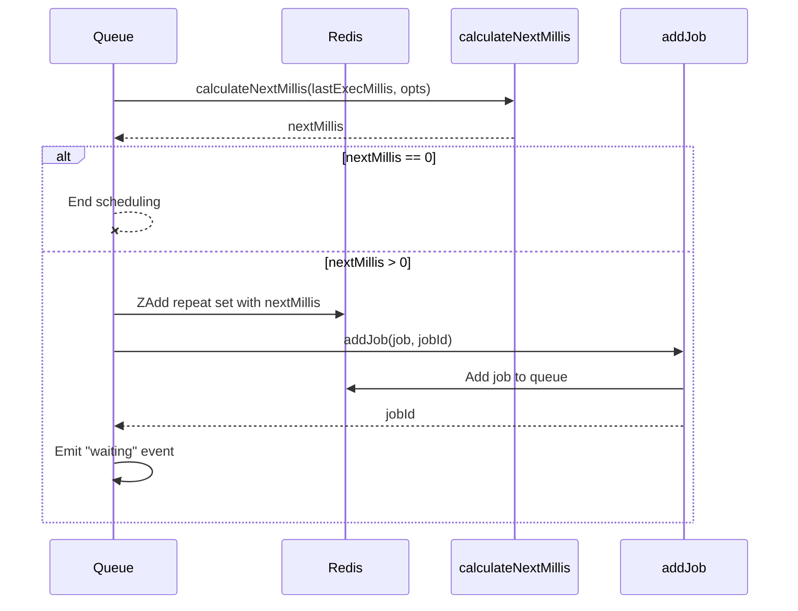

# Repeatable

Repeatable jobs are a feature within the BullMQ system that allows for the scheduling and execution of jobs at regular intervals, defined by either a cron-like pattern or a fixed time interval. This functionality is useful for tasks that need to be performed periodically, such as sending recurring reports or performing regular data backups. Repeatable jobs are configured through specific options when adding a job to the queue, and the system automatically schedules subsequent instances of the job based on the provided settings.

The implementation involves calculating the next execution time, storing job details in Redis, and managing the job lifecycle to ensure proper execution and scheduling of future instances. The system handles various configurations including start and end dates, limits on the number of repetitions, and timezones. This page details the configuration, scheduling, and management of repeatable jobs within the BullMQ system.

## Repeatable Job Configuration

Repeatable jobs are configured using the `JobRepeatOptions` struct, which defines the parameters for scheduling the job's recurring execution. These options include specifying a cron-like pattern or a fixed interval, along with optional start and end dates, and a limit on the number of repetitions. The `AddWithRepeat` function in `common.go` is used to set these options when adding a job to the queue. The `types.JobOptions` struct contains a `Repeat` field of type `*types.JobRepeatOptions` to hold these settings.

### Key Configuration Options

| Option        | Type         | Description                                                                                                 | Source |
| ------------- | ------------ | ----------------------------------------------------------------------------------------------------------- | ------ |
| `Pattern`     | string       | A cron-like pattern defining the schedule for the job.                                                      |        |
| `Every`       | int          | Interval in milliseconds to repeat the job.                                                                 |        |
| `StartDate`   | `*time.Time` | Optional start date for the repeatable job. If not set, the job starts immediately.                         |        |
| `EndDate`     | `*time.Time` | Optional end date for the repeatable job. If set, the job will not repeat after this date.                  |        |
| `Limit`       | int          | Optional limit on the number of job repetitions. If set, the job will not repeat after reaching this limit. |        |
| `Immediately` | bool         | If set to true, the repeated job should start right now (work only with every settings)                     |        |
| `Count`       | int          | The start value for the repeat iteration count.                                                             |        |
| `TZ`          | string       | Timezone for the cron pattern. Defaults to UTC if not specified.                                            |        |
| `JobId`       | string       | Optional Job ID to use.                                                                                     |        |

### Example Configuration

The following code snippet demonstrates how to add a repeatable job to the queue with a fixed interval:

```go
_, err = queue.Add(ctx, "repeatableTest", jobPayload,
	gobullmq.AddWithRepeat(types.JobRepeatOptions{
		Every: 5000, // Repeat every 5 seconds
	}),
)
if err != nil {
	fmt.Println("Error adding repeatable job:", err)
}
```

This example adds a job named "repeatableTest" that repeats every 5 seconds.

## Repeatable Job Scheduling

The scheduling of repeatable jobs involves calculating the next execution time based on the configured options and adding the job to the queue with a delay. The `addRepeatableJob` function in `queue.go` handles the initial scheduling of the first instance of a repeatable job. The `scheduleNextRepeatableJob` function schedules subsequent instances after a job completes. The `calculateNextMillis` function determines the next execution time in milliseconds.

### Scheduling Process



The sequence diagram illustrates the scheduling process. The `calculateNextMillis` function calculates the next execution time, and if valid, the job is added to the queue and a "waiting" event is emitted.

### Calculating the Next Execution Time

The `calculateNextMillis` function in `queue.go` calculates the next execution time based on the repeat options. It considers the cron pattern, interval, start and end dates, and limits. The function returns 0 if no further execution is scheduled.

The `internal/utils/repeat/repeat.go` also contains logic for calculating the next execution time, specifically within the `Strategy` function. This function determines the next execution time based on either a cron pattern or a fixed interval.

```go
func calculateNextMillis(lastExecMillis int64, opts *types.JobRepeatOptions) (int64, error) {
	if opts == nil {
		return 0, nil // Not a repeat job
	}

	// --- Check Stop Conditions --- //
	// Limit
	if opts.Limit > 0 && opts.Count >= opts.Limit {
		return 0, nil // Limit reached
	}
	// EndDate
	nowMillis := time.Now().UnixMilli()
	if opts.EndDate != nil && nowMillis >= opts.EndDate.UnixMilli() {
		return 0, nil // End date passed
	}

	// --- Calculate Next Time --- //
	var next time.Time
	baseTime := time.UnixMilli(lastExecMillis)

	if opts.Pattern != "" {
		// Cron pattern logic
    ...
```

This code snippet shows the initial checks and logic for calculating the next execution time in `calculateNextMillis`.

### Adding Repeatable Job to Queue

The `addRepeatableJob` function is responsible for adding the first instance of a repeatable job to the queue. It calculates the initial execution time, generates a job ID, and adds the job to the Redis repeat set.

```go
func (q *Queue) addRepeatableJob(ctx context.Context, name string, jsonData string, opts types.JobOptions, skipCheckExists bool) (types.Job, error) {
	if opts.Repeat == nil {
		return types.Job{}, fmt.Errorf("addRepeatableJob called without repeat options")
	}

	// Use time.Now() or StartDate for the initial calculation base
	initialBaseMillis := time.Now().UnixMilli()
	if opts.Repeat.StartDate != nil && initialBaseMillis < opts.Repeat.StartDate.UnixMilli() {
		initialBaseMillis = opts.Repeat.StartDate.UnixMilli()
	}
  ...
```

This code snippet shows the beginning of the `addRepeatableJob` function, which handles the initial scheduling.

## Repeatable Job Management

Repeatable jobs are managed through Redis sets and keys, which store the job's schedule and state. The `scheduleNextRepeatableJob` function is called after a repeatable job instance completes successfully to schedule the next instance.

### Redis Keys

The following Redis keys are used to manage repeatable jobs:

- `q.toKey("repeat")`: Stores the repeatable job keys and their next execution timestamps in a sorted set.
- `repeat.GetKey(name, *opts.Repeat)`: Generates a unique key for the repeatable job based on its name and repeat options.

### Scheduling Next Instance

The `scheduleNextRepeatableJob` function calculates the delay until the next execution and adds the job to the queue with that delay. This function is called upon completion of a repeatable job.

```go
func (q *Queue) scheduleNextRepeatableJob(ctx context.Context, name string, jsonData string, opts types.JobOptions) error {
	if opts.Repeat == nil {
		return fmt.Errorf("scheduleNextRepeatableJob called without repeat options")
	}
  ...
```

This code snippet shows the beginning of the `scheduleNextRepeatableJob` function.

### Job ID Generation

The `repeat.GetJobId` function generates a unique job ID for each instance of a repeatable job. This ID is based on the job name, next execution time, and a namespace.

```go
func GetJobId(name string, nextMillis int64, namespace string, jobId string) (string, error) {
	checksum := utils.MD5Hash(fmt.Sprintf("%s:%d:%s", name, jobId, namespace))
	return fmt.Sprintf("repeat:%s:%s", checksum, strconv.FormatInt(nextMillis, 10)), nil
}
```

This code snippet shows the `GetJobId` function in `internal/utils/repeat/repeat.go`.

## Lua Script Integration

Lua scripts are used to perform atomic operations on the Redis data, ensuring data consistency and performance. The `internal/lua/addJob_lua.go` file contains the Lua script used to add jobs to the queue. This script handles various aspects of job creation, including adding jobs with priority and managing delayed jobs. The `scripts.go` file contains functions for moving jobs to different states, such as failed or completed, using Lua scripts.

### Adding Job with Priority

The Lua script includes functions to add jobs with priority. These functions ensure that higher priority jobs are processed before lower priority jobs.

```lua
local function addJobWithPriority(waitKey, prioritizedKey, priority, paused, jobId, priorityCounterKey)
  local prioCounter = rcall("INCR", priorityCounterKey)
  local score = priority * 0x100000000 + bit.band(prioCounter, 0xffffffffffff)
  rcall("ZADD", prioritizedKey, score, jobId)
  if not paused then
    addPriorityMarkerIfNeeded(waitKey)
  end
end
```

This Lua snippet shows the `addJobWithPriority` function.

### Moving Jobs to Failed State

The `scripts.moveToFailedArgs` function prepares the arguments for moving a job to the failed state using a Lua script. This function is crucial for handling job failures and ensuring that the queue remains consistent.

```go
func (s *scripts) moveToFailedArgs(job *types.Job, failedReason string, removeOnFailed types.KeepJobs, token string, fetchNext bool) ([]string, []interface{}, error) {
	timestamp := time.Now()
	return s.moveToFinishedArgs(job, failedReason, "failedReason", removeOnFailed, "failed", token, timestamp, fetchNext)
}
```

This code snippet shows the `moveToFailedArgs` function in `scripts.go`.

## Conclusion

Repeatable jobs provide a powerful mechanism for scheduling recurring tasks within the BullMQ system. By leveraging cron-like patterns or fixed intervals, developers can easily configure jobs to run at specific times or intervals. The system's robust scheduling and management capabilities, combined with Redis's data storage and atomic operations, ensure that repeatable jobs are executed reliably and efficiently.
