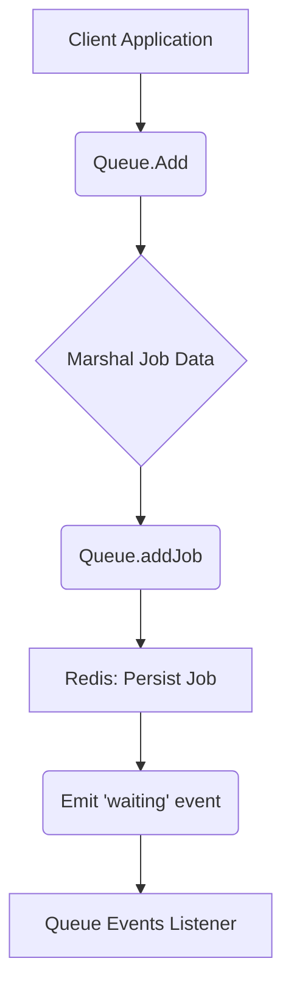
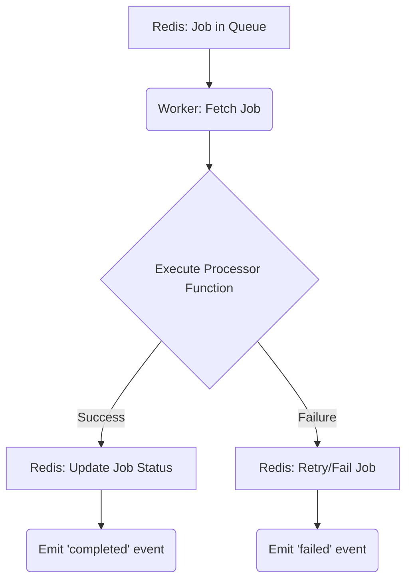
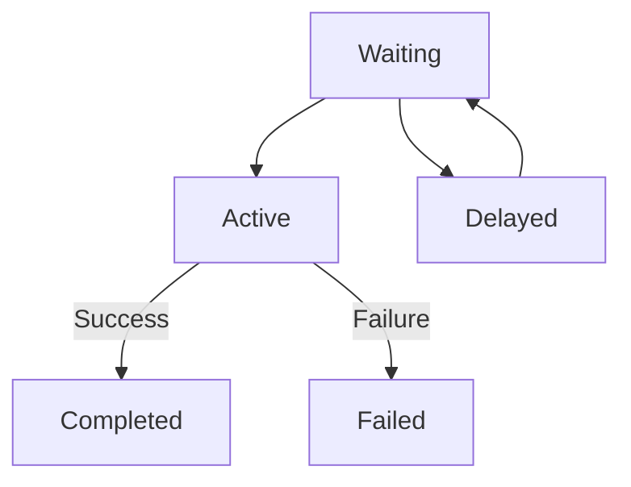
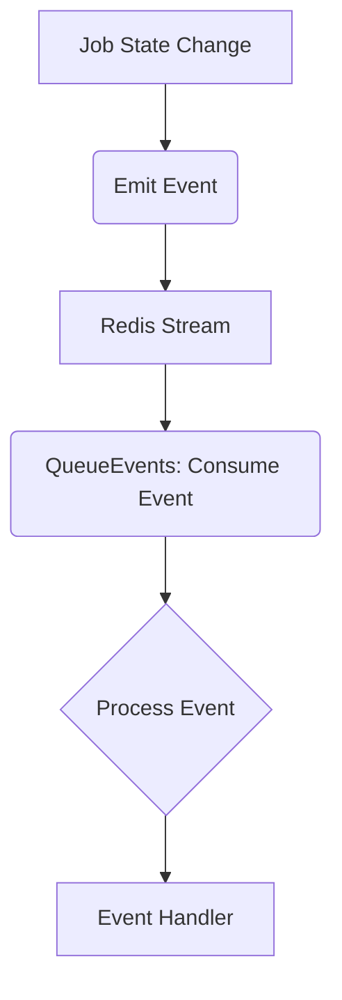

# Data Flow

This document outlines the data flow within the `gobullmq` job queue system. It covers how jobs are created, processed, and managed, including their movement through different states within the system. The data flow involves interactions between queues, workers, and event listeners, all facilitated by Redis.

## Job Creation and Addition

The process begins with adding a job to the queue. The `Add` function in `queue.go` is responsible for this. It takes the job name and data, marshals the data to JSON, and then calls the `addJob` function to persist the job in Redis.  Functional options can be applied during the `Add` process, such as setting priority, delay, or repeat configurations. .

```go
// Add adds a job to the queue with the specified name and data.
func (q *Queue) Add(ctx context.Context, name string, data interface{}, opts ...AddOption) (types.Job, error) {
	// ...
	jobId, err := q.addJob(ctx, job, opts.JobId) // Pass context
	if err != nil {
		return job, fmt.Errorf("failed to add job: %w", err)
	}
	job.Id = jobId

	// TODO: Consider making event emission asynchronous?
	q.Emit("waiting", job) // Emit job struct itself, or maybe just ID and name?

	return job, nil
}
```


### Data Structures Involved

*   **`types.Job`**: Represents a job with its data, options, and status.
*   **`JobOptions`**: Configuration options for a job, such as priority, delay, and attempts.

### Flow Diagram



This diagram illustrates the initial flow when a client application adds a job to the queue. The job data is marshaled and persisted in Redis, and a "waiting" event is emitted.

## Job Processing by Workers

Workers are responsible for processing jobs from the queue. The `NewWorker` function in `worker.go` initializes a worker with a specified concurrency and a processing function. The worker retrieves jobs from the queue and executes the processing function. .

```go
// NewWorker creates a new worker instance.
func NewWorker(ctx context.Context, name string, opts WorkerOptions, client redis.Cmdable, processor types.Processor) (*Worker, error) {
	// ...
	w := &Worker{
		Name:          name,
		Opts:          opts,
		Client:        client,
		Processor:     processor,
		scripts:       newScripts(client, ctx, keyPrefix),
		ee:            eventemitter.New(),
		KeyPrefix:     keyPrefix,
		blocking:      make(chan struct{}, opts.Concurrency),
		concurrency:   opts.Concurrency,
		ctx:           ctx,
		cancel:        cancel,
		running:       false,
		isClosing:     false,
		completedJobs: fifoqueue.NewFifoQueue[string](1000, true),
	}
	// ...
}
```


### Key Components

*   **`Worker`**: Represents a worker that processes jobs from the queue.
*   **`WorkerOptions`**: Configuration options for the worker, such as concurrency and stalled interval.
*   **`types.Processor`**: A function that defines the job processing logic.

### Data Flow Diagram



This diagram shows how a worker fetches a job from the queue, executes the processor function, and updates the job status in Redis based on the outcome.  Events are emitted to notify listeners of job completion or failure.

## Job States and Transitions

Jobs transition through different states during their lifecycle. These states include:

*   **Waiting**: The job is waiting to be processed.
*   **Active**: The job is currently being processed by a worker.
*   **Completed**: The job has been successfully processed.
*   **Failed**: The job has failed to be processed.
*   **Delayed**: The job is waiting for a specified delay before being processed.

### State Transition Logic

The `moveToFinishedArgs` function in `scripts.go` handles the transition of jobs to either the "completed" or "failed" state. This function prepares the arguments for a Lua script that updates the job's status in Redis and emits appropriate events.

```go
func (s *scripts) moveToFinishedArgs(job *types.Job, value string, propValue string, shouldRemove types.KeepJobs, target string, token string, timestamp time.Time, fetchNext bool) ([]string, []interface{}, error) {
	// Build the keys array - equivalent to moveToFinishedKeys in JS
	keys := []string{
		s.keyPrefix + "wait",
		s.keyPrefix + "active",
		s.keyPrefix + "prioritized",
		s.keyPrefix + "events",
		s.keyPrefix + "stalled",
		s.keyPrefix + "limiter",
		s.keyPrefix + "delayed",
		s.keyPrefix + "paused",
		s.keyPrefix + "meta",
		s.keyPrefix + "pc",
		s.keyPrefix + target,
		s.keyPrefix + job.Id,
		s.keyPrefix + "metrics:" + target,
	}

	// Convert job data to JSON string for the event
	eventData, err := json.Marshal(map[string]interface{}{
		"jobId": job.Id,
		"val":   value,
	})
	if err != nil {
		return nil, nil, fmt.Errorf("failed to marshal event data: %v", err)
	}

	// Prepare options map similar to JS implementation
	opts := map[string]interface{}{
		"token":          token,
		"keepJobs":       shouldRemove,
		"lockDuration":   30000, // TODO: Get from worker options?
		"attempts":       job.Opts.Attempts,
		"attemptsMade":   job.AttemptsMade,
		"maxMetricsSize": "",                                 // TODO: Get from metrics options?
		"fpof":           job.Opts.FailParentOnFailure,
```


### State Transition Diagram



This diagram illustrates the possible state transitions for a job within the queue system.

## Event Handling

The `QueueEvents` struct in `queue_events.go` provides a mechanism for listening to events emitted by the queue. These events include job completion, failure, and progress updates. The `Run` method starts the event listener, which consumes events from a Redis stream.  Event handlers can be registered using the `On` method. .

```go
// Run starts the queue events and listens for events from the redis stream
func (qe *QueueEvents) Run() error {
	qe.mutex.Lock()
	defer qe.mutex.Unlock()

	if qe.running {
		return errors.New("queue events is already running")
	}

	qe.running = true
	client := qe.redisClient

	client.Do(qe.ctx, "CLIENT", "SETNAME", fmt.Sprintf("%s:%s%s", qe.Prefix, base64.StdEncoding.EncodeToString([]byte(qe.Name)), ":qe"))

	qe.wg.Add(1)

	go func() {
		defer func() {
			qe.running = false
			qe.wg.Done()
		}()
		if err := qe.consumeEvents(client); err != nil {
			qe.Emit("error", fmt.Sprintf("Critical error in consumeEvents: %v", err))
			qe.cancel()
		}
	}()

	return nil
}
```


### Event Flow Diagram



This diagram illustrates the flow of events from a job state change to the registered event handlers.

### Key Functions

*   **`NewQueueEvents`**: Creates a new queue events instance.
*   **`Run`**: Starts listening for events from the Redis stream.
*   **`On`**: Registers an event handler for a specific event.

## Job Data Structure

The `types.Job` struct defines the structure of a job within the system. It includes fields for the job's name, ID, data, options, and status. The `Data` field can hold any type of data that can be marshaled to JSON.

```go
// Job represents a job with its associated data and options.
type Job struct {
	Name           string
	Id             string
	Data           JobData
	Opts           JobOptions
	OptsByJson     []byte
	ParentKey      string
	TimeStamp      int64
	Progress       int
	Delay          int
	DelayTimeStamp int64
	FinishedOn     time.Time
	ProcessedOn    time.Time
	RepeatJobKey   string
	FailedReason   string
	AttemptsMade   int
	Returnvalue    interface{}
	Token          string
}
```


### Job Data Table

| Field         | Type          | Description                                                        |
|---------------|---------------|--------------------------------------------------------------------|
| `Name`        | `string`      | The name of the job.                                               |
| `Id`          | `string`      | The unique identifier of the job.                                  |
| `Data`        | `JobData`     | The data associated with the job.                                  |
| `Opts`        | `JobOptions`  | The options for the job, such as priority and delay.                |
| `TimeStamp`   | `int64`       | The timestamp when the job was created.                            |
| `Progress`    | `int`         | The progress of the job (0-100).                                   |
| `Delay`       | `int`         | The delay in milliseconds before the job can be processed.          |
| `FinishedOn`  | `time.Time`   | The timestamp when the job was finished.                           |
| `FailedReason`| `string`      | The reason why the job failed, if applicable.                       |
| `AttemptsMade`| `int`         | Number of attempts made to process the job.                         |
| `Returnvalue` | `interface{}`| The return value of the job processor function.                     |

## Conclusion

The data flow within `gobullmq` involves the creation, processing, and management of jobs, facilitated by Redis. Jobs transition through different states, and events are emitted to notify listeners of state changes. The `types.Job` struct defines the structure of a job, and workers are responsible for processing jobs from the queue. The `QueueEvents` struct provides a mechanism for listening to events emitted by the queue.
