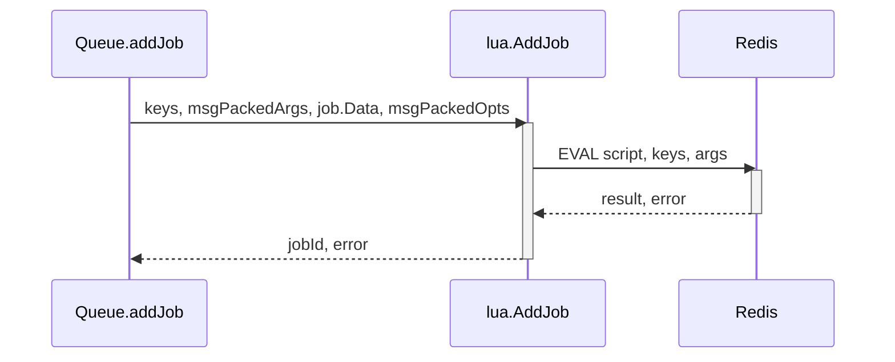

# Lua Scripting

Lua scripting is used within the project to extend the functionality of Redis operations. Go files are automatically generated from Lua scripts, which are then used to execute complex logic on the Redis server. This approach allows for atomic operations and reduces network latency by performing multiple operations in a single script execution. The generated Go files provide functions to call these Lua scripts from within the Go codebase.

## Lua Script Generation

The `scripts/generate_lua.go` file is responsible for generating Go files from Lua scripts. It reads Lua files from a specified directory, parses them, and creates corresponding Go files that can be used to execute those scripts. 

### Process Overview

The script generation process can be summarized as follows:

1.  **Find Root Path:** Determines the root path of the project using `git rev-parse --show-toplevel`. 
2.  **Load Scripts:** Loads all `.lua` files from the specified script directory (`./internal/lua`). 
3.  **Parse Scripts:** Parses each Lua script to extract its name, number of keys, and content. 
4.  **Generate Go Files:** Creates a Go file for each Lua script, embedding the Lua script content within a Go function. 
5.  **Format Lua Command:** Formats the Lua command by removing the number suffix, capitalizing the name for the function, and storing the content and number of keys. 
6.  **Execute Template:** Executes a Go template to create the Go file, including the Lua script as a string literal within the generated function. 

### Key Functions

*   `main()`: The entry point of the script generation process. It orchestrates the loading, parsing, and generation of Go files from Lua scripts. 
*   `loadScripts(dir string)`: Loads all Lua scripts from the specified directory. 
*   `loadCommand(file string, cache Cache)`: Loads a single Lua script from the specified file. 
*   `parseScript(filename, content string, cache Cache)`: Parses the content of a Lua script to extract metadata such as name and number of keys. 

### Data Structures

*   `LuaCommand`: Represents a Lua command with its name, function name, content, and number of keys. 
*   `Command`: Represents a command with its name and options, including the number of keys and the Lua script content. 
*   `ScriptMetadata`: Stores metadata about a Lua script, such as its name, number of keys, path, content, and includes. 
*   `Cache`: A map used to cache `ScriptMetadata` to avoid re-parsing the same script multiple times. 

### Code Snippet

```go
lc := LuaCommand{
    // remove -<number> from the name
    Name:     strings.Split(script.Name, "-")[0],
    FuncName: strings.Title(strings.Split(script.Name, "-")[0]),
    Content:  script.Options.Lua,
    Keys:     script.Options.NumberOfKeys,
}

// Delete the old file if it exists
os.Remove(filepath.Join(outputDir, lc.Name+"_lua.go"))

// Generate an individual Go file for each Lua script
outFile, err := os.Create(filepath.Join(outputDir, lc.Name+"_lua.go"))
if err != nil {
    log.Fatalf("failed to create output file: %v", err)
}

// Execute the template for the Lua script Go file
tmpl := template.Must(template.New("luaCommand").Parse(luaCommandFileTemplate))
err = tmpl.Execute(outFile, lc)
if err != nil {
    log.Fatalf("failed to execute template: %v", err)
}

outFile.Close()
```

This code snippet from `scripts/generate_lua.go` shows how the `LuaCommand` struct is populated with data extracted from the Lua script and how the Go file is created using a template. 

## Lua Script Examples

The `internal/lua` directory contains several Lua script examples, each designed for a specific purpose. These scripts are embedded in Go files and executed using the `go-redis/redis/v8` library.

### `isFinished_lua.go`

This script checks if a job is finished (i.e., is in the completed or failed set). 

```lua
--[[
  Checks if a job is finished (.i.e. is in the completed or failed set)
  Input:
    KEYS[1] completed key
    KEYS[2] failed key
    KEYS[3] job key
    ARGV[1] job id
    ARGV[2] return value?
  Output:
    0 - Not finished.
    1 - Completed.
    2 - Failed.
   -1 - Missing job.
]]
local rcall = redis.call
if rcall("EXISTS", KEYS[3]) ~= 1 then
  if ARGV[2] == "1" then
    return {-1,"Missing key for job " .. KEYS[3] .. ". isFinished"}
  end
  return -1
end
if rcall("ZSCORE", KEYS[1], ARGV[1]) ~= false then
  if ARGV[2] == "1" then
    local returnValue = rcall("HGET", KEYS[3], "returnvalue")
    return {1,returnValue}
  end
  return 1
end
if rcall("ZSCORE", KEYS[2], ARGV[1]) ~= false then
  if ARGV[2] == "1" then
    local failedReason = rcall("HGET", KEYS[3], "failedReason")
    return {2,failedReason}
  end
  return 2
end
if ARGV[2] == "1" then
  return {0}
end
return 0
```

### `promote_lua.go`

This script promotes a job from the "delayed" state to the "waiting" state. 

### `updateData_lua.go`

This script updates the data associated with a job. 

### `updateProgress_lua.go`

This script updates the progress of a job. 

### Key Functions in Generated Go Files

Each generated Go file contains a function that executes the corresponding Lua script. These functions take a `redis.Cmdable` client, a slice of keys, and a variable number of arguments. For example, the `IsFinished` function in `internal/lua/isFinished_lua.go` has the following signature:

```go
func IsFinished(client redis.Cmdable, keys []string, args ...interface{}) (interface{}, error)
```

This function executes the `isFinished` Lua script on the Redis server using the provided keys and arguments. 

## Usage within the Queue System

The Lua scripts are used within the queue system to perform various operations on jobs. For example, the `addJob` function in `queue.go` uses the `AddJob` Lua script to add a new job to the queue. 

### Adding a Job

The `addJob` function prepares the arguments for the `AddJob` Lua script and then executes it using the `lua.AddJob` function. The arguments include the job ID, name, timestamp, and parent key (if applicable). The job options are also passed to the Lua script. 

```go
givenJobId, err := lua.AddJob(rdb, keys, msgPackedArgs, job.Data, msgPackedOpts)
if err != nil {
    return "", fmt.Errorf("failed to add job via Lua: %w", err)
}
```

### Data Flow



This sequence diagram illustrates the data flow when adding a job to the queue using the `AddJob` Lua script. The `Queue.addJob` function calls the `lua.AddJob` function, which in turn executes the Lua script on the Redis server. The result is then returned to the `Queue.addJob` function.

## Conclusion

Lua scripting provides a powerful and efficient way to extend the functionality of Redis operations within the project. By generating Go files from Lua scripts, the project can execute complex logic on the Redis server in an atomic and performant manner. The various Lua script examples demonstrate the versatility of this approach for managing jobs within the queue system.
