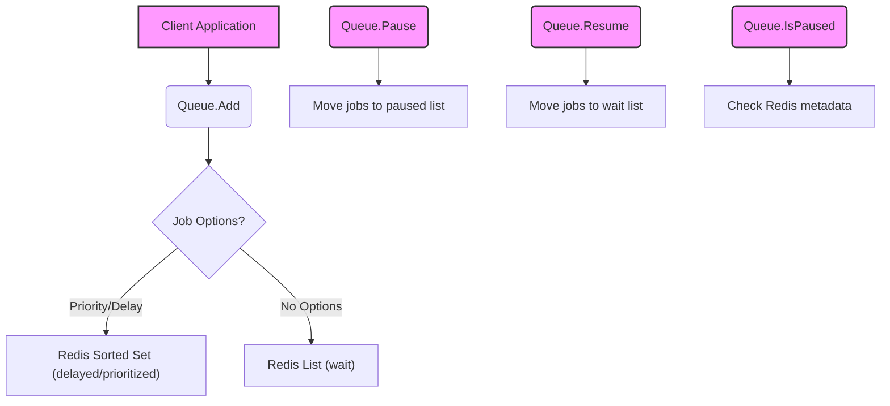
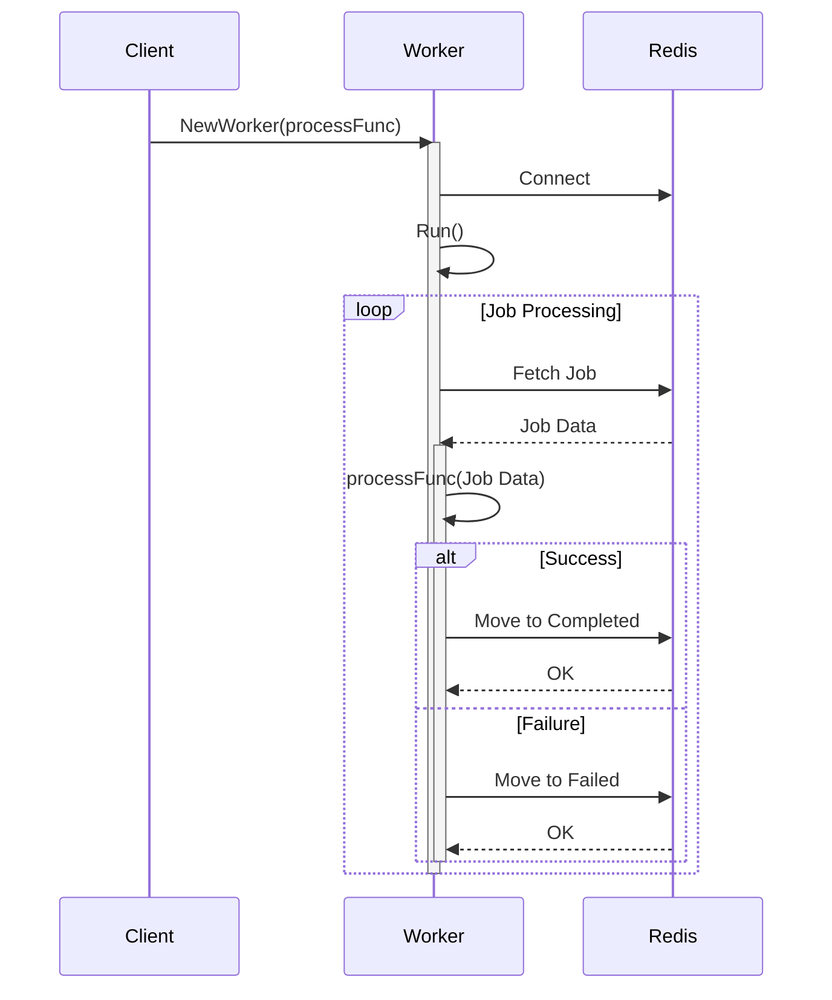
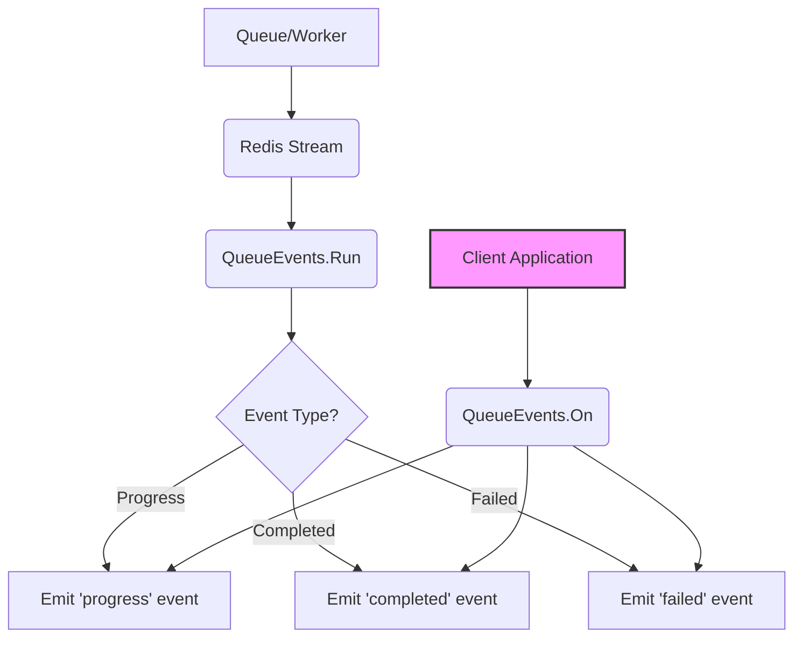
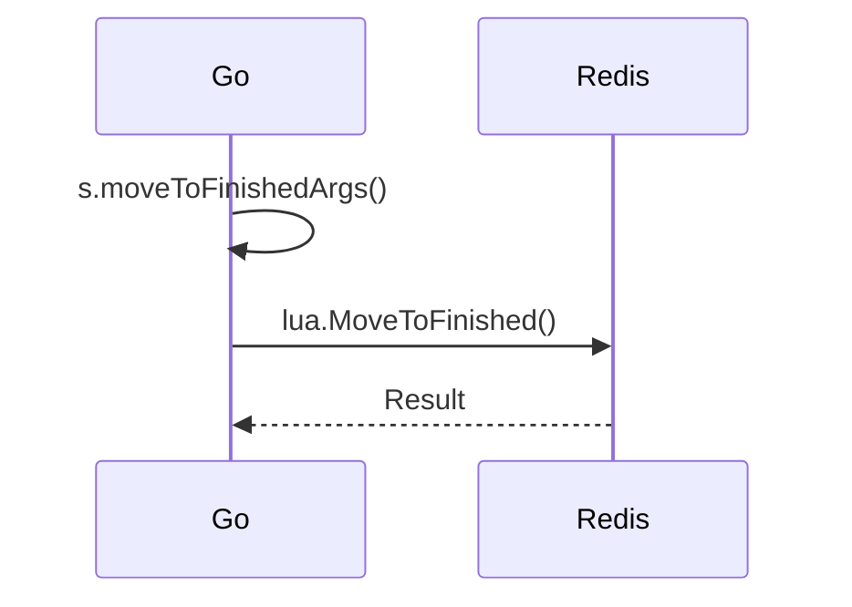

# Overview

The `gobullmq` library provides a job queue system built on top of Redis. It allows for creating, processing, and managing jobs in a distributed environment. Key components include the Queue for adding jobs, the Worker for processing jobs, and QueueEvents for listening to queue events. This architecture supports features like job prioritization, delayed jobs, repeatable jobs, and reliable job processing.

## Queue Architecture

The `Queue` component is responsible for adding jobs to the Redis-backed queue. It provides methods for adding jobs with various options, pausing and resuming the queue, and checking if the queue is paused. The queue uses Redis lists and sorted sets to manage jobs in different states (waiting, delayed, prioritized).  The core functionality relies heavily on Lua scripts for atomicity and performance. .

### Key Functions and Data Flow

1.  **`NewQueue`**: Initializes a new queue, setting up the Redis connection and applying functional options for configuration. .
2.  **`Add`**: Adds a job to the queue. This involves serializing job data and options, then using a Lua script (`AddJob`) to atomically add the job to the appropriate Redis data structures based on its options (e.g., priority, delay). .
3.  **`Pause`**: Pauses the queue, preventing new jobs from being processed by moving jobs from the "wait" queue to the "paused" queue using the `Pause` Lua script. .
4.  **`Resume`**: Resumes the queue, allowing jobs to be processed by moving jobs from the "paused" queue to the "wait" queue using the `Pause` Lua script. .
5.  **`IsPaused`**: Checks if the queue is currently paused by verifying the existence of the "paused" key in the Redis metadata. .



This diagram illustrates the basic flow of adding jobs to the queue and the pause/resume functionality. .

### Data Structures

The `Queue` component utilizes several Redis data structures:

*   **Lists**: Used for the "wait" and "paused" queues, holding job IDs. .
*   **Sorted Sets**: Used for "delayed" and "prioritized" jobs, allowing for time-based and priority-based retrieval. .
*   **Hashes**: Used to store job metadata, including job options, data, and state. .
*   **Streams**: Used for queue events, providing a chronological record of queue activity. .

### Code Snippet: Adding a Job

```go
job, err := queue.Add(ctx, "myJob", jobData,
    gobullmq.AddWithPriority(5),
    gobullmq.AddWithDelay(2000), // Delay by 2 seconds
)
if err != nil {
    log.Fatalf("Failed to add job: %v", err)
}
log.Printf("Added job %s with ID: %s\n", job.Name, job.Id)
```

This snippet demonstrates adding a job to the queue with a specific priority and delay. .

## Worker Architecture

The `Worker` component processes jobs from the queue. It continuously polls the queue for new jobs and executes a user-defined processing function for each job. The worker handles concurrency, stalled job detection, and error handling. .

### Key Functions and Data Flow

1.  **`NewWorker`**: Initializes a new worker, configuring concurrency, stalled job interval, and the job processing function. .
2.  **`Run`**: Starts the worker, launching multiple goroutines to process jobs concurrently. .
3.  **Job Processing**: The worker fetches jobs from the queue (typically the "wait" or "prioritized" queues), executes the user-defined processing function, and then moves the job to a "completed" or "failed" state. .
4.  **Stalled Job Detection**: The worker periodically checks for stalled jobs (jobs that have been in the "active" state for longer than the `StalledInterval`) and moves them back to the "wait" queue for reprocessing. .



This sequence diagram illustrates the worker's job processing loop. .

### Worker Options

The `WorkerOptions` struct configures the worker's behavior:

| Option            | Type   | Description                                                              |
| ----------------- | ------ | ------------------------------------------------------------------------ |
| `Concurrency`     | `int`  | The number of concurrent jobs the worker can process.                   |
| `StalledInterval` | `int`  | The interval (in milliseconds) for checking stalled jobs.               |

.

### Code Snippet: Worker Initialization

```go
worker, err := gobullmq.NewWorker(ctx, queueName, gobullmq.WorkerOptions{
    Concurrency:     1,
    StalledInterval: 30000,
}, redis.NewClient(redisOpts), workerProcess)
if err != nil {
    fmt.Println("Error initializing worker:", err)
    return
}
```

This snippet demonstrates initializing a worker with specific concurrency and stalled interval settings. .

## Queue Events Architecture

The `QueueEvents` component allows listening to events emitted by the queue, such as job completion, failure, and progress updates. It uses Redis streams to subscribe to these events and emits them to registered listeners. .

### Key Functions and Data Flow

1.  **`NewQueueEvents`**: Initializes a new queue events listener, setting up the Redis connection and configuring options such as `Autorun`. .
2.  **`Run`**: Starts the queue events listener, subscribing to the Redis stream and processing incoming events. .
3.  **`On`**: Registers a listener function for a specific event. .
4.  **`Emit`**: Emits an event to all registered listeners. .
5.  **`processEvent`**: Processes events read from the Redis stream, unmarshaling data as necessary and emitting the event to local listeners. .



This diagram illustrates the flow of events from the queue to the event listeners. .

### QueueEvents Options

The `QueueEventsOptions` struct configures the queue events listener:

| Option        | Type             | Description                                                    |
| ------------- | ---------------- | -------------------------------------------------------------- |
| `RedisClient` | `redis.Client`   | The Redis client used for connecting to the Redis server.      |
| `Autorun`     | `bool`           | Whether to automatically start listening for events.           |
|`LastEventId`|`string`|The last event ID to start consuming from.|

.

### Code Snippet: Setting up Event Listeners

```go
events.On("completed", func(args ...interface{}) {
    fmt.Println("Job completed:", args)
})
events.On("error", func(args ...interface{}) {
    fmt.Println("Error event:", args)
})
```

This snippet demonstrates setting up listeners for the "completed" and "error" events. .

## Job Structure

The `Job` struct represents a job in the queue. It contains information about the job's name, data, options, state, and progress.  The `JobOptions` provide extensive control over job behavior. .

### Key Fields

| Field          | Type        | Description                                                                                                                                                                                                                              |
| -------------- | ----------- | ---------------------------------------------------------------------------------------------------------------------------------------------------------------------------------------------------------------------------------------- |
| `Name`         | `string`    | The name of the job.                                                                                                                                                                                                                   |
| `Data`         | `interface{}` | The data associated with the job.                                                                                                                                                                                                      |
| `Opts`         | `JobOptions`| The options for the job, controlling its behavior (e.g., priority, delay, attempts).                                                                                                                                                     |
| `Id`           | `string`    | The unique ID of the job.                                                                                                                                                                                                              |
| `TimeStamp`    | `int64`     | The timestamp when the job was created.                                                                                                                                                                                                |
| `Progress`     | `int`       | The progress of the job (an integer value).                                                                                                                                                                                            |
| `Delay`        | `int`       | The delay (in milliseconds) before the job becomes eligible for processing.                                                                                                                                                           |
| `FinishedOn`   | `time.Time` | The timestamp when the job finished processing.                                                                                                                                                                                         |
| `ProcessedOn`  | `time.Time` | The timestamp when the job started processing.                                                                                                                                                                                         |
| `RepeatJobKey` | `string`    | The key for repeatable jobs.                                                                                                                                                                                                           |
| `FailedReason` | `string`    | The reason why the job failed (if it failed).                                                                                                                                                                                          |
| `AttemptsMade` | `int`       | The number of attempts made to process the job.                                                                                                                                                                                         |
|`ParentKey`|`string`|The key of the parent job, if this job is a child of another job.|

.

### Code Snippet: Job Creation

```go
job := types.Job{
    Name: "testJob",
    Data: jobPayload,
    Opts: opts,
}
```

This snippet demonstrates creating a `Job` struct with a name, data, and options. .

## Lua Scripts

The `gobullmq` library relies heavily on Lua scripts for atomicity and performance. These scripts encapsulate complex operations on Redis data structures, such as adding jobs, moving jobs between queues, and updating job progress. .

### Key Lua Scripts

*   **`AddJob`**: Adds a job to the queue, handling priority, delay, and other options. .
*   **`Pause`**: Pauses or resumes the queue by moving jobs between the "wait" and "paused" queues. .

### Code Snippet: Lua Script Execution

```go
givenJobId, err := lua.AddJob(rdb, keys, msgPackedArgs, job.Data, msgPackedOpts)
if err != nil {
    return "", fmt.Errorf("failed to add job via Lua: %w", err)
}
```

This snippet demonstrates executing the `AddJob` Lua script from Go. .

## Job Processing Scripts

The `scripts.go` file encapsulates methods for moving jobs between different states within the queue, such as moving them to the failed or completed queues. It also handles updating job progress and managing job retention policies. .

### Key Functions

*   **`moveToFailedArgs`**: Prepares arguments for moving a job to the failed queue. .
*   **`moveToFinishedArgs`**: Prepares arguments for moving a job to a finished state (completed or failed). .
*   **`updateProgress`**: Updates the progress of a job. .



This sequence diagram illustrates how the `moveToFinishedArgs` function prepares arguments for a Lua script that moves a job to a finished state. .

## Summary

The `gobullmq` architecture provides a robust and flexible job queue system built on Redis. It uses a combination of Go code and Lua scripts to manage jobs, handle concurrency, and provide event notifications. The key components are the Queue, Worker, and QueueEvents, which work together to provide a complete job processing solution.
