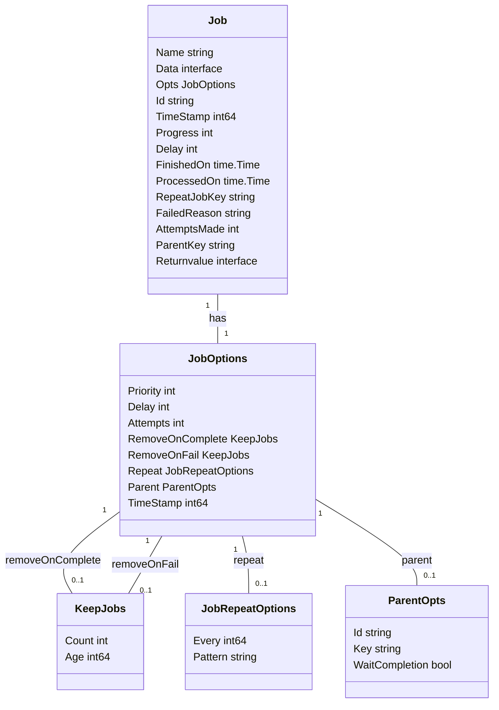

# Redis Data Structures

This document outlines the usage of Redis data structures within the `gobullmq` library. `gobullmq` leverages Redis to manage job queues, including storing job data, managing job states (waiting, active, delayed, completed, failed), and implementing priority and concurrency controls. The library uses various Redis data structures such as lists, sets, sorted sets, hashes, and streams to achieve its functionalities. Understanding how these structures are employed is crucial for debugging, monitoring, and extending the `gobullmq` library.

## Overview of Data Structures

`gobullmq` uses a combination of Redis data structures to implement its job queue functionality. These include:

*   **Lists:** Used for queues like `wait` and `paused` to store job IDs in a specific order.
*   **Sets:** Used to store unique job IDs in sets like `completed` and `failed`.
*   **Sorted Sets:** Used for managing delayed and prioritized jobs.
*   **Hashes:** Used to store job details, including data, options, and state.
*   **Streams:** Used for event streams to track job lifecycle events.

## Lists: Wait and Paused Queues

Redis lists are used to implement the `wait` and `paused` queues. These lists hold job IDs, representing the order in which jobs are enqueued or paused. The `LPUSH` and `RPUSH` commands are used to add jobs to the head or tail of these lists, respectively, while `LREM` is used to remove jobs.  The choice between `LPUSH` and `RPUSH` depends on whether the queue operates in LIFO (Last In, First Out) or FIFO (First In, First Out) order.

### Managing Paused State

The `paused` queue is used to temporarily halt job processing. Jobs can be moved between the `wait` and `paused` queues based on the queue's paused state, which is determined by the existence of the `meta.paused` key in a Redis hash. The `getTargetQueueList` function in Lua scripts checks for this key to determine the appropriate target queue.

### Priority Markers

To handle job prioritization, special "priority marker" elements ( `"0:0"`) are added to the `wait` queue. These markers signal workers to respect priority order. The `addPriorityMarkerIfNeeded` function adds these markers when the `wait` queue is empty.

## Sorted Sets: Delayed and Prioritized Jobs

Sorted sets are used for managing delayed and prioritized jobs. The score of each member in the sorted set represents the delay timestamp or the priority score, respectively.

### Delayed Jobs

The `delayed` sorted set stores job IDs with their respective timestamps as scores. This allows the system to efficiently retrieve jobs that are ready to be processed based on their delay.  The `ZRANGE` command is used to fetch jobs with the earliest timestamps.

### Prioritized Jobs

The `prioritized` sorted set stores job IDs with a combined score derived from the job's priority and a priority counter. This ensures that higher-priority jobs are processed before lower-priority ones, while also maintaining fairness among jobs with the same priority. The `ZADD` command adds jobs to the `prioritized` set with their calculated scores.

## Hashes: Job Details

Redis hashes are used to store job details, including job data, options, state, and results. Each job has a unique key in Redis, and the hash associated with that key contains all the relevant information about the job.

### Job Data and Options

The `HSET` command is used to set the values of fields within the job's hash, such as `data`, `opts`, `name`, and `progress`. The `HGETALL` command is used to retrieve all the fields and values of the job's hash.

### Job State

The job's state, such as `completedOn`, `processedOn`, and `failedReason`, is also stored in the job's hash. These fields are updated as the job progresses through its lifecycle.

### Data Structure

## Streams: Event Streams

Redis streams are used to implement event streams, which provide a way to track job lifecycle events in real-time. Each queue has an associated event stream, and events such as `waiting`, `active`, `completed`, and `failed` are added to the stream as they occur.

### Adding Events

The `XADD` command is used to add events to the stream. Each event includes the event type, job ID, and any relevant data.

### Trimming Events

To prevent the event stream from growing indefinitely, the `XTRIM` command is used to trim the stream to a maximum length. The `opts.maxLenEvents` option in the queue's metadata determines the maximum number of events to keep.

## Lua Scripting for Atomic Operations

`gobullmq` extensively uses Lua scripting to perform complex operations atomically within Redis. This ensures data consistency and avoids race conditions.  Several Lua scripts are used for various operations, including:

*   `addJob`: Adds a new job to the queue.
*   `moveToFinished`: Moves a job to the completed or failed set.
*   `promote`: Promotes a delayed job to the waiting state.
*   `cleanJobsInSet`: Removes jobs from a specific set (e.g., completed, failed).
*   `drain`: Removes all waiting or delayed jobs from the queue.
*   `moveStalledJobsToWait`: Moves stalled jobs back to the wait queue.

### Example: Adding a Job

The `addJob` Lua script performs several operations atomically, including:

1.  Adding the job to the appropriate queue (wait, paused, or delayed).
2.  Adding the job to the prioritized set if it has a priority.
3.  Adding an event to the event stream.
4.  Trimming the event stream.

### Lua Script Generation

The Lua scripts are stored in the `internal/lua` directory and are automatically generated using the `scripts/generate_lua.go` script. This script reads the Lua source files and generates Go code that embeds the Lua scripts and provides functions for executing them.

## Data Cleanup

To prevent Redis from accumulating excessive data, `gobullmq` provides mechanisms for cleaning up completed and failed jobs. The `removeOnComplete` and `removeOnFail` options in the job options determine when and how jobs are removed from the completed and failed sets.

### Clean Jobs In Set

The `CleanJobsInSet` Lua script is used to remove jobs from a specified set (e.g., completed, failed) based on a timestamp and a limit. This script is used to enforce the `removeOnComplete` and `removeOnFail` policies.

## Conclusion

`gobullmq` relies heavily on Redis data structures and Lua scripting to implement its job queue functionality. Understanding how these structures are used is essential for developing, debugging, and maintaining the library. The use of atomic operations via Lua scripts ensures data consistency and reliability.
