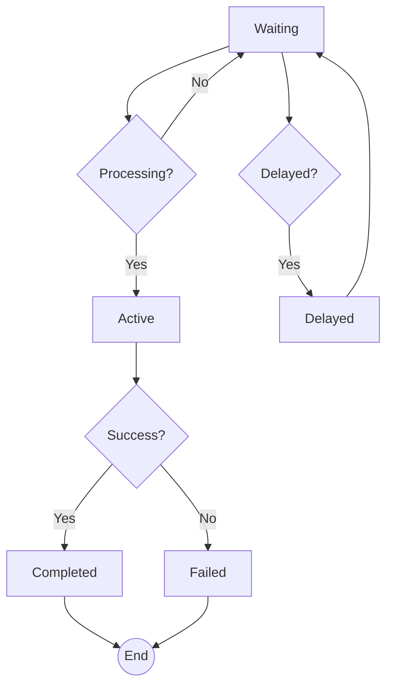

# Redis Interaction

This page details how the `gobullmq` library interacts with Redis to manage job queues, workers, and related events. Redis is used as the primary data store for managing job states, queue metadata, and implementing various queue operations through Lua scripts for atomicity and performance. The library leverages Redis features such as streams, sets, lists, and pub/sub for different aspects of queue management.

## Core Data Structures in Redis

`gobullmq` uses several Redis data structures to manage queues and jobs. Understanding these structures is crucial for comprehending the system's behavior.

### Sets

Redis sets are used to store unique job IDs for different job states.

*   **Wait Queue:** Stores IDs of jobs waiting to be processed.
*   **Active Queue:** Stores IDs of jobs currently being processed.
*   **Completed Queue:** Stores IDs of successfully completed jobs.
*   **Failed Queue:** Stores IDs of jobs that have failed.
*   **Delayed Queue:** Stores IDs of jobs scheduled for delayed processing.
*   **Prioritized Queue:** Stores IDs of jobs with assigned priorities. 

### Lists

Redis lists are used for queue-like operations, especially for waiting jobs.

*   **Wait Queue:** Implemented as a list to maintain job order.  Jobs are pushed onto the list, and workers pop jobs from the list for processing. 

### Streams

Redis streams are used for event logging and real-time updates.

*   **Events Stream:**  Used to record queue events like job completion, failure, progress updates, and job additions. 

### Hashes

Redis hashes are used to store job-specific data and metadata.

*   **Job Data:** Each job is represented as a hash, storing details like job name, data, options, progress, and status. 

## Lua Script Usage

To ensure atomicity and efficiency, `gobullmq` uses Lua scripts for several Redis operations. These scripts perform complex operations on Redis data structures in a single atomic transaction.

### Examples of Lua Scripts

*   **`updateData`:** Updates the data associated with a job. 
*   **`updateProgress`:** Updates the progress of a job and publishes a progress event to the event stream. 
*   **`promote`:** Moves a delayed job to the waiting queue when its delay time has passed. 
*   **`isFinished`:** Checks if a job is finished (either completed or failed). 
*   **`reprocessJob`:** Moves a job from a finished state back to the waiting queue for reprocessing. 
*   **`cleanJobsInSet`:** Removes jobs from a specific set (e.g., completed, failed) based on a timestamp and a limit. 
*   **`moveStalledJobsToWait`:** Moves stalled jobs from the active queue back to the waiting queue. 
*   **`changePriority`:** Changes the priority of a job in the queue. 
*   **`obliterate`:** Completely removes a queue and all its associated data. 
*   **`drain`:** Removes all waiting and delayed jobs from the queue. 
*   **`moveJobsToWait`:** Moves jobs from a completed, failed, or delayed state back to the waiting queue. 
*   **`getState`:** Gets the current state of a job. 

### Lua Script Execution Flow

The `scripts` struct in `scripts.go` provides methods to prepare arguments for and execute these Lua scripts.

```go
type scripts struct {
	redisClient redis.Cmdable   // Redis client used to interact with the redis server
	ctx         context.Context // Context used to handle the queue events
	keyPrefix   string
}
```

The `scripts` struct holds the Redis client, context, and key prefix used to construct Redis keys.  It provides methods like `moveToFailedArgs` and `moveToFinishedArgs` to prepare the keys and arguments needed by the Lua scripts.  The Lua scripts are then executed using `client.Eval`. 

### Example: `updateProgress` Lua Script

This script updates the progress of a job and adds an event to the event stream.

```lua
--[[
  Update job progress
  Input:
    KEYS[1] Job id key
    KEYS[2] event stream key
    ARGV[1] id
    ARGV[2] progress
  Output:
     0 - OK
    -1 - Missing job.
  Event:
    progress(jobId, progress)
]]
local rcall = redis.call
if rcall("EXISTS",KEYS[1]) == 1 then -- // Make sure job exists
  rcall("HSET", KEYS[1], "progress", ARGV[2])
  rcall("XADD", KEYS[2], "*", "event", "progress", "jobId", ARGV[1], "data", ARGV[2]);
  return 0
else
  return -1
end
```

This script first checks if the job exists. If it does, it updates the `progress` field in the job's hash and adds a `progress` event to the event stream.  The Go code to execute this script looks like this:

```go
// UpdateProgress executes the Lua script updateProgress on Redis with 2 keys.
func UpdateProgress(client redis.Cmdable, keys []string, args ...interface{}) (interface{}, error) {
	if len(keys) != 2 {
		return nil, fmt.Errorf("expected 2 keys but got %d", len(keys))
	}
	luaScript := `--[[
  Update job progress
  Input:
    KEYS[1] Job id key
    KEYS[2] event stream key
    ARGV[1] id
    ARGV[2] progress
  Output:
     0 - OK
    -1 - Missing job.
  Event:
    progress(jobId, progress)
]]
local rcall = redis.call
if rcall("EXISTS",KEYS[1]) == 1 then -- // Make sure job exists
  rcall("HSET", KEYS[1], "progress", ARGV[2])
  rcall("XADD", KEYS[2], "*", "event", "progress", "jobId", ARGV[1], "data", ARGV[2]);
  return 0
else
  return -1
end
`
	result, err := client.Eval(context.Background(), luaScript, keys, args...).Result()
	if err != nil {
		return nil, err
	}
	return result, nil
}
```


## Job Lifecycle and State Transitions

The job lifecycle involves several state transitions, each managed through Redis interactions.

### States

*   **Waiting:** Job is in the queue, waiting to be processed.
*   **Active:** Job is currently being processed by a worker.
*   **Completed:** Job has been processed successfully.
*   **Failed:** Job processing resulted in an error.
*   **Delayed:** Job is scheduled to be processed at a later time.
*   **Paused:** Queue is paused, and jobs are not being processed.

### State Transition Diagram



This diagram illustrates the basic flow of a job through the system.  The `getState` Lua script is used to determine the current state of a job. 

### Moving Jobs Between States

Jobs are moved between states using Lua scripts to ensure atomicity. For example, when a job fails, the `JobMoveToFailed` function in `job.go` is used.

```go
func JobMoveToFailed(s *scripts, job *types.Job, err error, token string, removeOnFailed types.KeepJobs, fetchNext bool) error {
	job.FailedReason = err.Error()

	// TODO: Consider saving stacktrace here if needed, similar to JS version.

	keys, args, scriptErr := s.moveToFailedArgs(job, job.FailedReason, removeOnFailed, token, fetchNext)
	if scriptErr != nil {
		// Consider emitting an error event here or logging
		return fmt.Errorf("error preparing move to failed args for job %s: %w", job.Id, scriptErr)
	}

	// Use the keys and args here to call the appropriate Lua script
	_, luaErr := lua.MoveToFinished(s.redisClient, keys, args...)
	if luaErr != nil {
		// Consider emitting an error event here or logging
		return fmt.Errorf("error executing move to failed via Lua for job %s: %w", job.Id, luaErr)
	}

	// TODO: Consider emitting a 'failed' event here, although the worker currently does this.

	return nil
}
```

This function prepares the arguments for the `moveToFinished` Lua script (not directly provided, but implied by the function name and arguments) and executes it to move the job to the `failed` set. 

## Key Management

Redis keys are constructed using a prefix to avoid collisions with other applications using the same Redis instance. The `keyPrefix` field in the `scripts` struct is used for this purpose.  Keys are constructed by concatenating the prefix with queue names, job IDs, and other identifiers.  For example:

*   `{keyPrefix}wait`: Key for the waiting queue.
*   `{keyPrefix}active`: Key for the active queue.
*   `{keyPrefix}{jobId}`: Key for a specific job's data. 

## Conclusion

`gobullmq` relies heavily on Redis for managing job queues and ensuring reliable job processing.  Lua scripts are used extensively to perform atomic operations and maintain data consistency.  Understanding the Redis data structures and Lua scripts is essential for debugging and extending the functionality of `gobullmq`.
