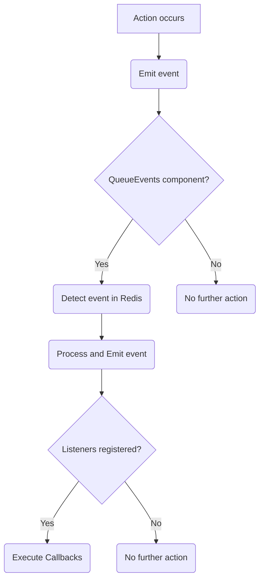
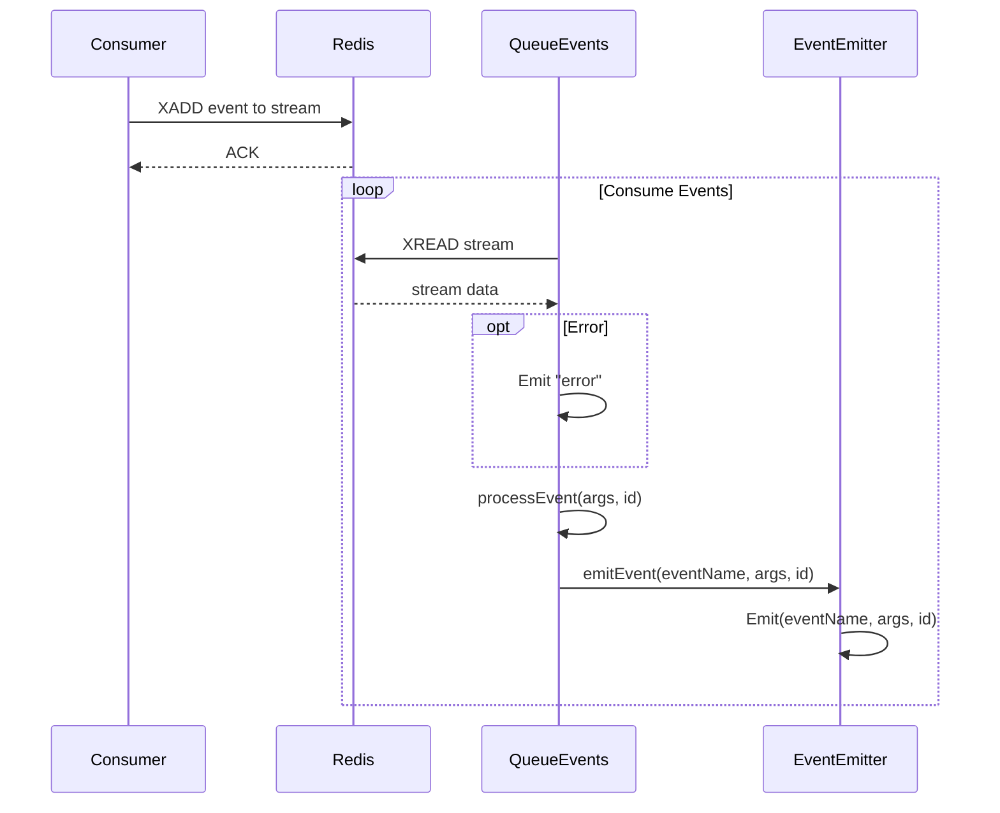

# Event Handling

Event handling is a crucial aspect of the `gobullmq` library, enabling different components to communicate and react to state changes within the job queue system. This system relies on emitting and listening for events, providing a loosely coupled architecture where components can respond to specific occurrences without direct dependencies. The `QueueEvents` struct in `queue_events.go` manages the event consumption from Redis streams, processing and emitting those events to registered listeners. The `EventEmitter` struct in `internal/eventEmitter/eventEmitter.go` provides the core functionality for emitting and listening to events within the Go application. [Link to Queue Component](#queue-component)

## Overview of Event Handling

The `gobullmq` library uses a custom event emitter, implemented in `internal/eventEmitter/eventEmitter.go`, to manage events.  This event emitter allows components to subscribe to specific events and execute callbacks when those events are emitted.  The `QueueEvents` struct in `queue_events.go` acts as a bridge between the Redis streams and the internal event emitter, consuming events from Redis and emitting them within the Go application. This allows external processes or services to trigger actions within the `gobullmq` system by publishing events to the Redis stream.

### Key Components

*   **EventEmitter:** Manages event listeners and emission.
*   **QueueEvents:** Consumes events from Redis streams and emits them using the internal event emitter.

### Event Flow

The event flow typically involves the following steps:

1.  An action occurs within the system (e.g., a job is added, completed, or fails).
2.  The component performing the action emits an event using the `EventEmitter`.
3.  The `QueueEvents` component, if running, detects the event in the Redis stream.
4.  The `QueueEvents` component processes the event and emits it using its internal `EventEmitter`.
5.  Any listeners registered for that event receive the event data and execute their corresponding callbacks.



This diagram illustrates the general flow of events within the `gobullmq` system.

## EventEmitter

The `EventEmitter` struct, defined in `internal/eventEmitter/eventEmitter.go`, provides the core functionality for managing events within the `gobullmq` library. It allows components to subscribe to events, emit events, and remove listeners.

### Structure

```go
type EventEmitter struct {
	eventChan map[string]chan []interface{}
}
```

The `EventEmitter` struct contains a map called `eventChan`. This map stores channels for each event type. When an event is emitted, data is sent to the channel, and any listeners subscribed to that event receive the data.

### Key Functions

| Function             | Description                                                                                                                                                                                                                                                                                                                                                                                                                        | Source                                                                  |
| -------------------- | ---------------------------------------------------------------------------------------------------------------------------------------------------------------------------------------------------------------------------------------------------------------------------------------------------------------------------------------------------------------------------------------------------------------------------------- | ----------------------------------------------------------------------- |
| `NewEventEmitter()`  | Creates a new `EventEmitter` instance, initializing the `eventChan` map.                                                                                                                                                                                                                                                                                                                                                        |                          |
| `Init()`             | Re-initializes the `eventChan` map, effectively clearing all existing listeners.                                                                                                                                                                                                                                                                                                                                                   |                          |
| `On(event, listener)` | Subscribes a listener function to a specific event. When the event is emitted, the listener function is executed with the event data.                                                                                                                                                                                                                                                                                            |                          |
| `Once(event, listener)`| Subscribes a listener function to a specific event. The listener function is executed only once when the event is emitted, and then it is automatically removed.                                                                                                                                                                                                                                                                |                          |
| `Emit(event, args...)`| Emits an event, sending the provided data to all subscribed listeners.                                                                                                                                                                                                                                                                                                                                                             |                          |
| `RemoveListener(event, listener)` | Removes a specific listener function from an event.                                                                                                                                                                                                                                                                                                                                                                   |                          |
| `RemoveAllListeners(event)` | Removes all listeners from a specific event.                                                                                                                                                                                                                                                                                                                                                                                |                          |

This table summarizes the key functions of the `EventEmitter` and their descriptions.

### Example Usage

```go
ee := eventemitter.NewEventEmitter()

ee.On("job.completed", func(args ...interface{}) {
    fmt.Println("Job completed:", args)
})

ee.Emit("job.completed", "jobID-123")
```

This code snippet demonstrates how to create an `EventEmitter`, subscribe to the `job.completed` event, and emit the event with some data.

## QueueEvents

The `QueueEvents` struct, defined in `queue_events.go`, is responsible for consuming events from a Redis stream and emitting them using the internal `EventEmitter`. This allows the `gobullmq` system to react to events triggered by external processes or services that publish to the Redis stream.

### Structure

```go
type QueueEvents struct {
	eventemitter.EventEmitter
	Name        string
	Prefix      string
	KeyPrefix   string
	Opts        QueueEventsOptions
	redisClient redis.Client
	ctx         context.Context
	cancel      context.CancelFunc
	running     bool
	mutex       sync.Mutex
	wg          sync.WaitGroup
	ee          *eventemitter.EventEmitter
}
```

The `QueueEvents` struct contains several fields, including:

*   `EventEmitter`: Embeds the `EventEmitter` to provide event handling capabilities.
*   `Name`: The name of the queue.
*   `Prefix`:  A prefix for the queue's keys in Redis.
*   `KeyPrefix`: The key prefix used for Redis keys.
*   `Opts`: Configuration options for the `QueueEvents` instance.
*   `redisClient`: The Redis client used to connect to the Redis server.
*   `ctx`: The context used for managing the lifecycle of the `QueueEvents` instance.
*   `cancel`: A function to cancel the context.
*   `running`: A boolean indicating whether the `QueueEvents` instance is running.
*   `mutex`: A mutex to protect access to shared resources.
*   `wg`: A wait group to wait for the background goroutine to finish.
*    `ee`: A pointer to the internal `EventEmitter` instance.

### Key Functions

| Function                | Description                                                                                                                                                                                                                                                                                                                                                                                                                          | Source                       |
| ----------------------- | ------------------------------------------------------------------------------------------------------------------------------------------------------------------------------------------------------------------------------------------------------------------------------------------------------------------------------------------------------------------------------------------------------------------------------------ | ---------------------------- |
| `NewQueueEvents()`      | Creates a new `QueueEvents` instance, initializes the Redis client, and starts listening for events if `Autorun` is enabled.                                                                                                                                                                                                                                                                                                         |     |
| `Run()`                 | Starts the `QueueEvents` instance, connecting to the Redis stream and consuming events.                                                                                                                                                                                                                                                                                                                                             |    |
| `Close()`               | Stops the `QueueEvents` instance, closing the connection to the Redis stream and waiting for the background goroutine to finish.                                                                                                                                                                                                                                                                                                     |    |
| `consumeEvents()`       | Consumes events from the Redis stream, processing each event and emitting it using the internal `EventEmitter`.                                                                                                                                                                                                                                                                                                                      |   |
| `processEvent()`        | Processes a single event, extracting the event name and data, and emitting the event using the internal `EventEmitter`.                                                                                                                                                                                                                                                                                                               |   |
| `emitEvent()`           | Emits the event with the given name and arguments.                                                                                                                                                                                                                                                                                                                                                                                    |   |
| `Emit(event, args...)`  | Emits an event using the internal `EventEmitter`.                                                                                                                                                                                                                                                                                                                                                                                    |     |
| `On(event, listener)`   | Subscribes a listener function to a specific event using the internal `EventEmitter`.                                                                                                                                                                                                                                                                                                                                                |     |
| `Off(event, listener)`  | Removes a specific listener function from an event using the internal `EventEmitter`.                                                                                                                                                                                                                                                                                                                                                |     |
| `Once(event, listener)` | Subscribes a listener function to a specific event using the internal `EventEmitter`. The listener function is executed only once when the event is emitted, and then it is automatically removed.                                                                                                                                                                                                                                  |     |

This table summarizes the key functions of the `QueueEvents` struct and their descriptions.

### Example Usage

```go
events, err := gobullmq.NewQueueEvents(ctx, queueName, gobullmq.QueueEventsOptions{
    RedisClient: *redis.NewClient(redisOpts),
    Autorun:     true,
})
if err != nil {
    fmt.Println("Error initializing queue events:", err)
    return
}

events.On("completed", func(args ...interface{}) {
    fmt.Println("Job completed:", args)
})
```

This code snippet demonstrates how to create a `QueueEvents` instance and subscribe to the `completed` event.

### Event Processing

The `consumeEvents` function continuously reads events from the Redis stream using the `XRead` command.  It then iterates through each stream and message, calling the `processEvent` function to handle the event.

The `processEvent` function extracts the event name and arguments from the message. For specific events like "progress" and "completed", it unmarshals the data from a JSON string. Finally, it calls the `emitEvent` function to emit the event using the internal `EventEmitter`.



This sequence diagram illustrates how `QueueEvents` consumes and processes events from Redis.

## Queue Component

The `Queue` component in `queue.go` also utilizes event emitting for various job lifecycle events.

### Emitted Events

| Event      | Description                               | Source           |
| ---------- | ----------------------------------------- | ---------------- |
| `waiting`  | Emitted when a job is added to the queue. |  |
| `paused`   | Emitted when the queue is paused.         |  |
| `resumed`  | Emitted when the queue is resumed.        |  |

These events allow other parts of the system to react to changes in the queue's state.

## Worker Component

The `Worker` component in `worker.go` also utilizes event emitting for various job processing events.

### Emitted Events

| Event       | Description                                     | Source           |
| ----------- | ----------------------------------------------- | ---------------- |
| `"error"`   | Emitted when an error occurs during processing. |  |

This event allows other parts of the system to react to errors during job processing.

## Conclusion

Event handling in `gobullmq` provides a flexible and decoupled mechanism for components to react to state changes within the system. The `EventEmitter` and `QueueEvents` structs work together to enable both internal and external event-driven communication, making the system more extensible and maintainable.
