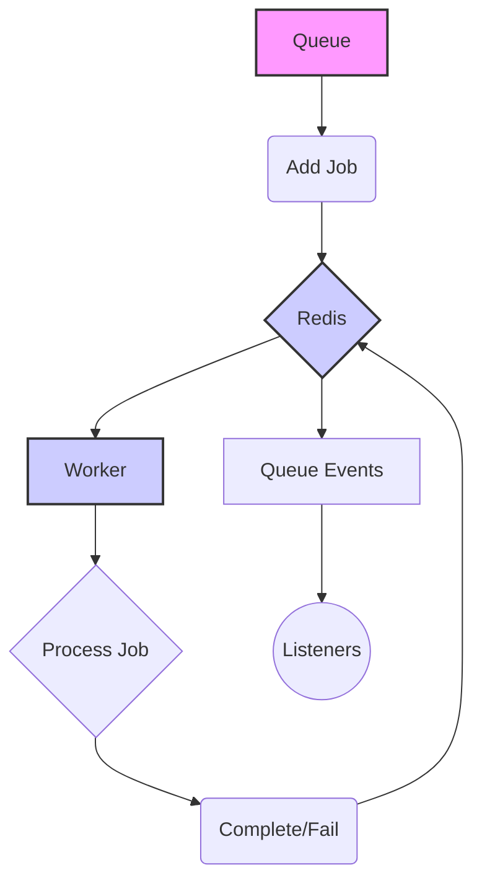

# Getting Started

BullMQ for Golang is a job queue library that utilizes Redis for managing and processing jobs. It provides tools for creating queues, defining workers to process jobs, and listening for events during the job lifecycle. This page guides you through the initial steps to set up and use BullMQ in your Go applications.

This guide will cover setting up a queue, adding jobs to it, creating a worker to process those jobs, and listening for queue events. Configuration options and examples of adding different types of jobs will also be provided.

## Installation

To begin using BullMQ for Golang, install the package using the `go get` command:

```bash
go get go.codycody31.dev/gobullmq
```
This command downloads and installs the `gobullmq` package along with its dependencies.

## Basic Usage

### Creating a Queue

A queue is the foundation for managing jobs. Here's how to create a new queue:

```go
import (
	"context"
	"log"

	"github.com/go-redis/redis/v8"
	"go.codycody31.dev/gobullmq"
)

func main() {
	ctx := context.Background()
	redisOpts := &redis.Options{
		Addr: "127.0.0.1:6379", // Or your Redis server address
		// Password: "your_password", // Uncomment if needed
		DB: 0, // Default DB
	}

	queue, err := gobullmq.NewQueue(ctx, "myQueue",
		gobullmq.WithRedisOptions(redisOpts),
		// Optional: Set a custom key prefix
		// gobullmq.WithKeyPrefix("myCustomPrefix"),
	)
	if err != nil {
		log.Fatalf("Failed to create queue: %v", err)
	}
}
```

This code snippet initializes a new queue named "myQueue" and configures it to connect to a Redis server. The `WithRedisOptions` function sets the connection parameters for Redis.

### Adding Jobs to the Queue

Once the queue is set up, you can add jobs to it. Jobs can contain any data that can be serialized into JSON.

```go
	jobData := struct {
		Message string
		Count   int
	}{
		Message: "Hello BullMQ!",
		Count:   1,
	}

	// Add a job using functional options
	job, err := queue.Add(ctx, "myJob", jobData,
		gobullmq.AddWithPriority(5),
		gobullmq.AddWithDelay(2000), // Delay by 2 seconds
	)
	if err != nil {
		log.Fatalf("Failed to add job: %v", err)
	}
	log.Printf("Added job %s with ID: %s\n", job.Name, job.Id)
```

This example adds a job named "myJob" to the queue with a priority of 5 and a delay of 2 seconds.

### Processing Jobs with a Worker

Workers process jobs from the queue. You need to define a worker function that will be executed for each job.

```go
import (
	"context"
	"fmt"

	"github.com/go-redis/redis/v8"
	"go.codycody31.dev/gobullmq"
	"go.codycody31.dev/gobullmq/types"
)

func main() {
	// ... (Queue setup)

	workerProcess := func(ctx context.Context, job *types.Job) (interface{}, error) {
		fmt.Printf("Processing job: %s\n", job.Name)
		return nil, nil
	}

	worker, err := gobullmq.NewWorker(ctx, "myQueue", gobullmq.WorkerOptions{
		Concurrency:     1,
		StalledInterval: 30000,
	}, redis.NewClient(&redis.Options{
		Addr:     "127.0.0.1:6379",
		Password: "",
	}), workerProcess)
	if err != nil {
		log.Fatal(err)
	}

	worker.Run()
	worker.Wait()
}
```

In this example, `workerProcess` is the function that processes each job.  The `NewWorker` function creates a worker that processes jobs from "myQueue" with a concurrency of 1 and a stalled interval of 30000 milliseconds. The `Run` method starts the worker, and `Wait` blocks until the worker is finished.

### Listening for Queue Events

Queue events allow you to monitor the lifecycle of jobs in the queue.

```go
import (
	"context"
	"fmt"

	"github.com/go-redis/redis/v8"
	"go.codycody31.dev/gobullmq"
)

func main() {
	// ... (Queue setup)

	events, err := gobullmq.NewQueueEvents(ctx, "myQueue", gobullmq.QueueEventsOptions{
		RedisClient: *redis.NewClient(&redis.Options{
			Addr:     "127.0.0.1:6379",
			Password: "",
			DB:       0,
		}),
		Autorun: true,
	})
	if err != nil {
		log.Fatal(err)
	}

	events.On("added", func(args ...interface{}) {
		fmt.Println("Job added:", args)
	})

	events.On("error", func(args ...interface{}) {
		fmt.Println("Error event:", args)
	})
}
```

This code creates a new `QueueEvents` instance that listens for events on the "myQueue" queue.  The `On` method registers event listeners for "added" and "error" events.

## Configuration Options

Configuration is primarily managed using functional options passed to `NewQueue`, `NewWorker`, and `NewQueueEvents`.

### Queue Functional Options

| Option                      | Type             | Description                                                              | Default Value | Source File(s) |
| --------------------------- | ---------------- | ------------------------------------------------------------------------ | ------------- | ---------------- |
| `WithRedisOptions`          | `*redis.Options` | Sets the Redis connection options.                                      | N/A           |     |
| `WithKeyPrefix`             | `string`         | Sets a custom prefix for Redis keys.                                    | `"bull"`      |     |
| `WithStreamsEventsMaxLen`   | `int64`          | Sets the maximum length for the events stream.                          | `10000`       |     |

### Worker Options

| Option            | Type    | Description                                               | Source File(s) |
| ----------------- | ------- | --------------------------------------------------------- | ---------------- |
| `Concurrency`       | `int`   | The number of concurrent jobs the worker can process.     |     |
| `StalledInterval` | `int`   | The interval for checking stalled jobs (milliseconds). |     |

### QueueEvents Options

| Option        | Type           | Description                                         | Source File(s) |
| ------------- | -------------- | --------------------------------------------------- | ---------------- |
| `RedisClient` | `redis.Client` | The Redis client used for connecting to the server. |     |
| `Autorun`     | `bool`         | Whether to automatically start listening for events.  |     |

## Advanced Job Management

### Adding a Repeatable Job

```go
import (
	"context"
	"log"

	"github.com/go-redis/redis/v8"
	"go.codycody31.dev/gobullmq"
	"go.codycody31.dev/gobullmq/types"
)

func main() {
    ctx := context.Background()
    redisOpts := &redis.Options{
        Addr: "127.0.0.1:6379",
    }
    queue, err := gobullmq.NewQueue(ctx, "myQueue",
        gobullmq.WithRedisOptions(redisOpts),
    )
    if err != nil {
        log.Fatal(err)
    }

    jobData := map[string]string{"task": "send_email", "to": "user@example.com"}

    // Add a job that repeats every 10 seconds
    _, err = queue.Add(ctx, "myRepeatableJob", jobData,
        gobullmq.AddWithRepeat(types.JobRepeatOptions{
            Every: 10000, // Repeat every 10000 ms (10 seconds)
        }),
    )
    if err != nil {
        log.Fatal(err)
    }
}
```

This code snippet adds a job that repeats every 10 seconds. The `AddWithRepeat` function configures the job to run at regular intervals using the `JobRepeatOptions` struct.

### Job Options

You can configure job behavior using functional options when adding a job:

*   `AddWithPriority(int)`: Sets the priority of the job.
*   `AddWithDelay(int)`: Sets the delay (in milliseconds) before the job is processed.
*   `AddWithAttempts(int)`: Sets the number of attempts for the job.
*   `AddWithRemoveOnComplete(gobullmq.KeepJobs{Count: 100})`: Keep last 100 completed jobs.
*   `AddWithRepeat(types.JobRepeatOptions)`: Configures the job to repeat based on the provided options.

### Job Structure

The `Job` struct contains information about a job, including its name, ID, data, and options.

```go
type Job struct {
	Name           string
	Id             string
	Data           JobData
	Opts           JobOptions
	OptsByJson     []byte
	ParentKey      string
	TimeStamp      int64
	Progress       int
	Delay          int
	DelayTimeStamp int64
	FinishedOn     time.Time
	ProcessedOn    time.Time
	RepeatJobKey   string
	FailedReason   string
	AttemptsMade   int
	Returnvalue    interface{}
	Token          string
}
```

The `JobOptions` struct defines the options for a job, such as priority, delay, and attempts.

```go
type JobOptions struct {
	Priority                  int              `json:"priority,omitempty" msgpack:"priority,omitempty"`                             // Higher values mean lower priority
	Delay                     int              `json:"delay,omitempty" msgpack:"delay,omitempty"`                                   // Delay in milliseconds
	Timestamp                 int64            `json:"timestamp,omitempty" msgpack:"timestamp,omitempty"`                             //
	Attempts                  int              `json:"attempts,omitempty" msgpack:"attempts,omitempty"`                               // Number of attempts
	Timeout                   int              `json:"timeout,omitempty" msgpack:"timeout,omitempty"`                                 //
	JobId                     string           `json:"jobId,omitempty" msgpack:"jobId,omitempty"`                                   //
	RemoveOnComplete          interface{}      `json:"removeOnComplete,omitempty" msgpack:"removeOnComplete,omitempty"`               //
	RemoveOnFail              interface{}      `json:"removeOnFail,omitempty" msgpack:"removeOnFail,omitempty"`                   //
	StacktraceLimit           int              `json:"stacktraceLimit,omitempty" msgpack:"stacktraceLimit,omitempty"`                 //
	FailParentOnFailure       bool             `json:"failParentOnFailure,omitempty" msgpack:"failParentOnFailure,omitempty"`         //
	RemoveDependencyOnFailure bool             `json:"removeDependencyOnFailure,omitempty" msgpack:"removeDependencyOnFailure,omitempty"` //
	Parent                    *ParentOptions   `json:"parent,omitempty" msgpack:"parent,omitempty"`                                 //
	Repeat                    *JobRepeatOptions `json:"repeat,omitempty" msgpack:"repeat,omitempty"`                                 //
	RepeatJobKey              string           `json:"repeatJobKey,omitempty" msgpack:"repeatJobKey,omitempty"`                       //
}
```

### Queue States

The queue can be in different states, such as `wait`, `active`, `completed`, `failed`, and `paused`. The `queue.Pause()` and `queue.Resume()` methods can be used to pause and resume the queue, respectively.

```go
// Pause pauses the queue, preventing new jobs from being processed.
func (q *Queue) Pause(ctx context.Context) error { // Added context
	if err := q.pause(ctx, true); err != nil {
		return fmt.Errorf("failed to pause queue: %w", err)
	}
	q.Emit("paused")
	return nil
}

// Resume resumes the queue, allowing jobs to be processed.
func (q *Queue) Resume(ctx context.Context) error { // Added context
	if err := q.pause(ctx, false); err != nil {
		return fmt.Errorf("failed to resume queue: %w", err)
	}
	q.Emit("resumed")
	return nil
}
```

## Architecture Overview



This diagram illustrates the basic flow of jobs through the BullMQ system. Jobs are added to the queue, stored in Redis, processed by workers, and then marked as complete or failed. Queue events allow listeners to monitor the progress of jobs.

## Conclusion

This guide provides a basic overview of how to get started with BullMQ for Golang. By following these steps, you can set up a job queue, add jobs, process them with workers, and monitor their progress using queue events. BullMQ provides a robust and flexible solution for managing background jobs in your Go applications.
